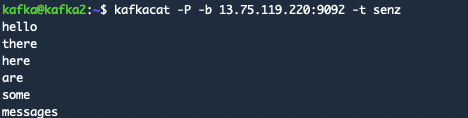
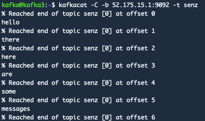
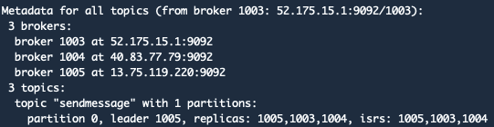
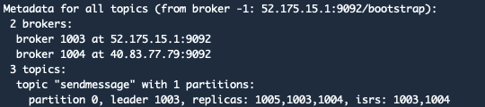

## CS3219 OTOT Task D

### Task

Create a 3 node Apache Kafka cluster using Docker that demonstrates the Pub-Sub messaging, with a Zookeeper ensemble created to manage the Kafka cluster.

### Server setup

There will be 3 kafka nodes and zookeeper nodes deployed across 3 different servers. Each of the server will run a single zookeeper node and a kafka node.

### Dependencies

For each of the server, run the following command to download the required dependencies for the setup and testing of the kafka clusters.

```bash
#Linux
sudo apt-get install docker docker-compose kafkacat
```

Docker-compose is used to set up the containers. Kafkacat is a command line client utility tool to interact with kafka.

### Setup Instructions

1. Fork and clone this repo to each of your 3 different machines.
2. Navigate to the repo directory.
3. Edit the `docker-compose.yml` file and add the IP addresses of each of your servers. 
4. Start up the zookeeper node and kafka node using the `docker-compose.yml` file.

```bash
#For server 1
docker-compose up -d zookeeper1 kafka1

#For server 2
docker-compose up -d zookeeper2 kafka2

#For server 3
docker-compose up -d zookeeper3 kafka3
```

### Using the Kafka Clusters

1. Create a topic. Use a replication-factor of more than 1 for the fail safe mechanism to work.

```bash
docker run --rm ches/kafka kafka-topics.sh --create --topic {topic_name} --replication-factor 3 --partitions 1 --zookeeper {any_server_ipadd}
```

2. Check if the topic has been successfully created.

```bash
kafkacat -L -b {any_server_ipadd}:9092
```

3. Once the topic is created, you can start sending messages. In order to do so, you need to have at least 1 publisher and 1 consumer. This can be done across different servers, or using the same server but through 2 terminals.

```bash
# Creating a publisher
kafkacat -P -b {any_server_ipadd}:9092 -t {topic_name}

# Creating a consumer
kafkacat -C -b {any_server_ipadd}:9092 -t {topic_name}
```

4. You can now type messages in the publisher terminal and see it appear in the consumer(s) terminal.





### Failure Management of Master Node

For each of the topic, there will be a leader nominated. 




For topics that have a `replication-factor` of more than 1, when the leader server is down (this can be simulated by stopping the docker container), one of the remaining kafka brokers in will take over as the leader.




In the first screenshot, the leader of the topic `sendmessage` was broker 1005. After the docker container for that broker was stopped, broker 1003 took over as the leader. 


